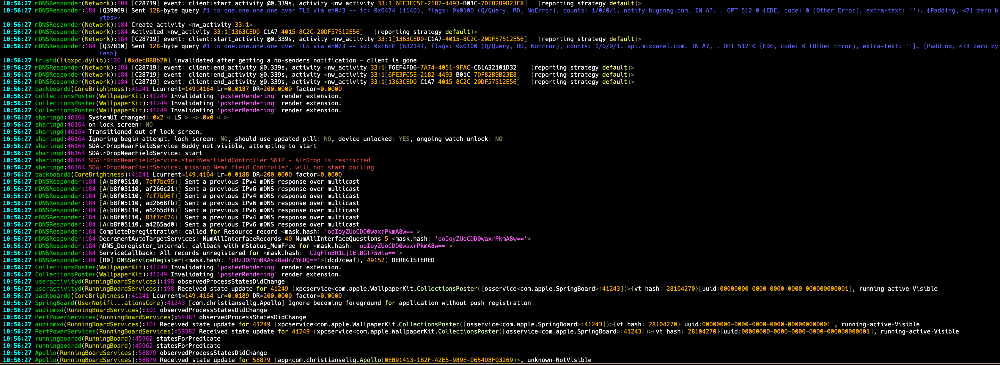
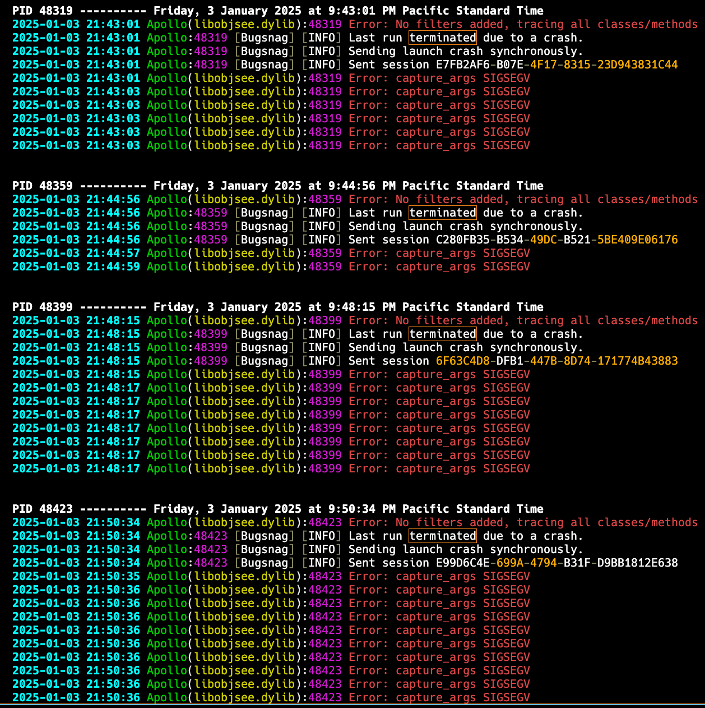

# oslo

`os_log` tool for iOS and macOS.

- View live logs in real-time
- View any PAST log by timestamp or timeago
- `<private>` replaced with original/real text
- Filtering, grouping, and output options

---

### Usage

```bash
oslo [process] [filters] [options]
````

#### **Process Selection:**

* `<name>` — Process name (case insensitive substring match)
* `<pid>` — PID  

*(or nothing to include ALL)*

---

#### **Filters**

*Only show logs that are:*

* `-L, --level <level>` — Log level `>= <level>` (`notice`, `debug`, `info`, `error`, `fault`)
* `-a, --after <time>` — After given time
  *(`-1h`, `-30m`, `-1d`, `-1w`, `HH:mm:ss`, `YYYY-MM-DD`, `YYYY-MM-DD HH:mm:ss`)*
* `-b, --before <time>` — Before given time
  *(`-1h`, `-30m`, `-1d`, `-1w`, `HH:mm:ss`, `YYYY-MM-DD`, `YYYY-MM-DD HH:mm:ss`)*
* `-c, --contains <text>` — Contains case-insensitive `<text>`
* `-x or -e, --exclude <text>` — Does NOT contain case-insensitive `<text>`
  *(Use multiple `--contains`/`--exclude` for AND matching)*
* `-l or -i, --library <text>` — Library or image path includes case-insensitive `<text>`

---

#### **Options**

* `-g, --group` — Group by process *(only for past logs)*
* `-j, --json` — Output in JSON format *(only for past logs)*
* `-f, --file <path>` — Write output to a file
* `-r, --repeats` — Collapse repeated identical messages *(default: disabled)*
* `-N, --no-color` — Disable color output
* `-S, --strip` — Strip newlines from log text
* `-h, --help` — Show usage information

---

### Usage Examples

```bash
# View live SpringBoard logs
oslo springboard

# View error logs from Notes app in the last 5 minutes
oslo notes --level error --after=-5m

# View error logs before 1 hour ago
oslo notes --level error --before=-1h

# View last 7 days, only logs containing 'error'
oslo notes --after=-7d --contains "error"

# Chain multiple contains/exclude filters
oslo --contains "network" --contains "error"
oslo --exclude "timeout" --exclude "retry"
oslo --contains "error" --contains "connection" --exclude "timeout" --exclude "retry"

# Filter logs by specific frameworks or libraries
oslo --image "NetworkExtension"
oslo --image "/System/Library/Frameworks/Foundation.framework"
oslo --image "UIKit" --contains "error"

# Search stored logs for crash details
oslo springboard --stored --contains "caught exception" --exclude "ReportCrash"
oslo springboard -s -c "*Exception" -e "simulated_crash"

# Export logs to a file
oslo springboard --level=error --file=errors.log

# Export last 24 hours to JSON
oslo --stored --after=-1d --json > logs.json

# Show network error logs excluding timeouts
oslo --contains "network error" --exclude "timeout"

# Follow live logs for a specific PID and write to file
oslo 12345 --file=logs.txt
```

---

### Requirements

* macOS 11.5 or later
* Jailbroken iOS 14.0 or later

  * Earlier versions may work (tested iOS 14.0 - 18.2)
  * Supports both rootless and rootful jailbreaks
* Pre-compiled releases for iOS include `armv7`, `armv7s`, and `arm64` slices

---

### Screenshots

#### Live log streaming



#### Stored logs grouped by PID



---

### Credits

* [Theldus](https://github.com/Theldus) for the [kat syntax highlighting](https://github.com/Theldus/kat/tree/master) library
